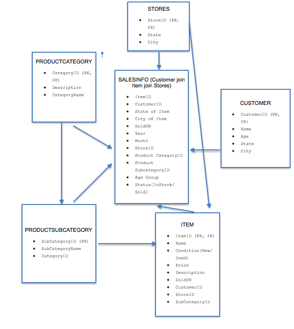
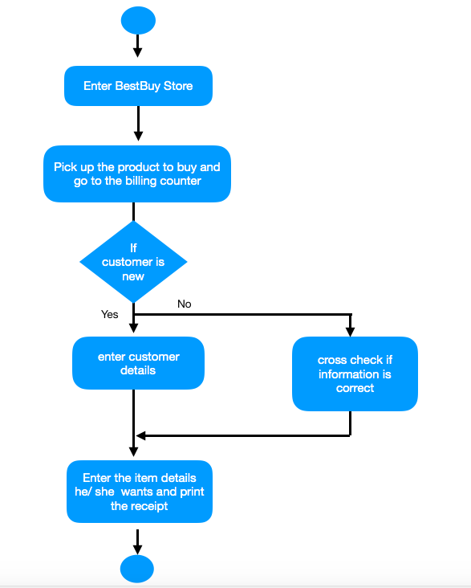

# DATABASE

# Project Report

## On

## ELECTRONIC (BESTBUY) STORE DATABASE

## MANAGEMENT AND DATA ANALYSIS

## By

## Nancy Jain

## MSBA

## Fall Quarter 2018


## Introduction: Problem Description

### The problem set was divided into two parts:-

### 1. Create a BestBuy database that contains store information, product categories, product subcategories, item information, customer information and sales information tables.

### 2. Create procedures to add an item, delete an item, sell an item, return an item, move an item from one store location to another and add a customer.

### 3. Create procedures to find out popular product by state, popular product by city, popular product by month, popular product by year, popular product category by state, popular product category by age group.


## Data Model:


## State chart Diagram:

### The state diagram shows the states of an object and represents activities as arrows connecting the states. The Activity Diagram highlights the activities. Each activity is represented by a rounded rectangle-narrower and more oval-shaped than the state icon. An arrow represents the transition from the one activity to the next. The activity diagram has a starting point represented by filled-in circle, and an end point represented by bulls eye.



# Implementation :


# Testing :

## Test Cases:

## ● Check if new item added has subcategory id and store id which is not in the list

## ● Check if item id or condition(new/used) of the new item entered is already there in the list
```sql
-- Create procedure to add an item
-- raise error if subcategory id and store id entered is not in given list
-- raise error if item id is already there in the list
-- raise error if condition entered is other than new or used
CREATE​ PROC sp_Add_Item @ItemID ​int​, @Condition ​NVARCHAR​(​ 5 ​), @Price ​money​, @StoreID
int​, @SubCategoryID ​int
As
​if​ @SubCategoryID ​not​ ​in​ (​Select​ SubCategoryID ​from​ dbo.ProductSubCategory)
​RAISERROR​(​'Invalid SubCategory ID'​, ​ 16 ​, ​ 1 ​)
​If​ @StoreID ​not​ ​in​ (​Select​ StoreID ​from​ dbo.Stores)
​RAISERROR​(​'Invalid Store ID'​, ​ 16 ​, ​ 1 ​)
​If​ @ItemID ​in​ (​Select​ ItemID ​from​ dbo.Item)
​RAISERROR​(​'Item ID already in Item'​, ​ 16 ​, ​ 1 ​)
​If​ @Condition ​not​ ​in​ (​'New'​, ​'Used'​)
​RAISERROR​(​'Enter the given condition : Used or New'​, ​ 16 ​, ​ 1 ​)
​Insert​ ​into​ dbo.Item ​VALUES​ (@ItemID, ​'Item'​ ​+​ ​CAST​(@ItemID ​as​ ​NVARCHAR​(​ 15 ​)),
@Condition, @Price, ​'described as-'​ ​+​ ​CAST​(@ItemID ​as​ ​NVARCHAR​(​ 20 ​)), ​NULL​, ​NULL​,
@StoreID, @SubCategoryID)
Go
```
## ● Check if item id of the item to be deleted entered is not there in the list
```sql
-- create procedure to delete an item
-- raise error if item id is not in the list


Create​ PROC sp_delete_item @ItemID ​INT
AS
​If​ @ItemID ​not​ ​in​ (​Select​ ItemID ​from​ dbo.Item)
​RAISERROR​(​'Item ID not in Item'​, ​ 16 ​, ​ 1 ​)
​Delete​ dbo.Item
​where​ ItemID ​=​ @ItemID
Go
```
## ● Check if item id of the item to be updated entered is not there in the list
```sql
-- create procedure to update the status of the item to sold and update the 'sold on'
date and enter the customer id of the customer who bought it
-- raise error if item id is not in the given list
Create​ PROC sp_Sell_item @ItemID ​INT​, @CustomerID ​int
AS
​If​ @ItemID ​not​ ​in​ (​Select​ ItemID ​from​ dbo.Item)
​RAISERROR​(​'Item ID not in Item'​, ​ 16 ​, ​ 1 ​)
​Update​ dbo.Item
​set​ SoldOn ​=​ ​GETDATE​(), CustomerID ​=​ @CustomerID
​where​ ItemID ​=​ @ItemID
Go
-- create procedure to update the status of the item to returned and update the 'sold
on' date
-- raise error if item id is not in the given list
Create​ PROC sp_Return_item @ItemID ​INT
AS
​If​ @ItemID ​not​ ​in​ (​Select​ ItemID ​from​ dbo.Item)
​RAISERROR​(​'Item ID not in Item'​, ​ 16 ​, ​ 1 ​)
​Update​ dbo.Item
​set​ SoldOn ​=​ ​NULL
​where​ ItemID ​=​ @ItemID

Go
```
## ● Check if item id or store id of the item to be updated is already there in the list
```sql
-- create procedure to update the store id of the item, if the item is moved to another store
-- raise error if item id or store id is not in the given list
Create​ PROC sp_Move_item_to_other_store @ItemID ​INT​, @StoreID ​INT
AS
​If​ @ItemID ​not​ ​in​ (​Select​ ItemID ​from​ dbo.Item)
​RAISERROR​(​'Item ID not in Item'​, ​ 16 ​, ​ 1 ​)
​If​ @StoreID ​not​ ​in​ (​Select​ StoreID ​from​ dbo.Stores)
​RAISERROR​(​'Invalid Store ID'​, ​ 16 ​, ​ 1 ​)
​Update​ dbo.Item
​set​ StoreID ​=​ @StoreID
​where​ ItemID ​=​ @ItemID
Go
```
## ● Check if new customer added is not in the list.

## ● Check if item id of the item bought by the customer is already there in the list
```sql
-- Customer insert
SELECT​ ​*​ ​from​ dbo.Customer
-- create procedure to add new customer and its information in the database
-- raise error if customer id for the new customer generated is already in the list
CREATE​ PROC sp_Add_Customer @CustomerID ​int​, @CustomerName ​NVARCHAR​(​ 15 ​), @Age ​int​,
@State ​NVARCHAR​(​ 15 ​), @City ​NVARCHAR​(​ 15 ​)
As
​If​ @CustomerID ​in​ (​Select​ CustomerID ​from​ dbo.Customer)
​RAISERROR​(​'CustomerID already exists'​, ​ 16 ​, ​ 1 ​)


​Insert​ ​into​ dbo.Customer ​VALUES​ (@CustomerID, @CustomerName, @Age, @State, @City)
Go
```
# Analysis :

## ● Calculate popular product city wise
```sql
-- create procedure to calculate popular product city wise
CREATE​ PROC sp_Items_By_City
AS
​select​ ​COUNT​(ItemID) ​as​ [Number of Items sold], CIty
​from​ view_Sales_Info
​GROUP by​ City
​order by​ ​ 1 ​ ​desc
Go
```
## ● Calculate popular product state wise
```sql
-- create procedure to calculate popular product state wise
CREATE​ PROC sp_Items_By_State
AS
​select​ ​COUNT​(ItemID) ​as​ [Number of Items sold], [State]
​from​ view_Sales_Info
​GROUP by​ [State]
​order by​ ​ 1 ​ ​desc
Go
```
## ● Calculate popular product year wise
```sql
-- create procedure to calculate popular product year wise
CREATE​ PROC sp_Items_By_Year
AS
​select​ ​COUNT​(ItemID) ​as​ [Number of Items sold], YearSoldOn
​from​ view_Sales_Info
​GROUP by​ YearSoldOn
​order by​ ​ 1 ​ ​desc
Go
```
## ● Calculate popular product month wise
```sql
-- create procedure to calculate popular product month wise
CREATE​ PROC sp_Items_By_Month
AS
​select​ ​COUNT​(ItemID) ​as​ [Number of Items sold], MonthSoldOn
​from​ view_Sales_Info
​GROUP by​ MonthSoldOn
​order by​ ​ 1 ​ ​desc
GO
```
## ● Calculate popular product category state wise
```sql
-- create procedure to calculate popular items Category state wise
CREATE​ PROC sp_ItemsCategory_By_State
AS
​select​ ​COUNT​(CategoryID) ​as​ [Number of Items Sold by Category], ​State
​from​ view_Sales_Info
​GROUP by​ [State]
​order by​ ​ 1 ​ ​desc
Go
```
## ● Calculate popular product category age-group wise
```sql
-- create procedure to calculate popular item category age-group wise
CREATE​ PROC sp_ItemsCategory_By_AgeGroup
AS
​select​ ​COUNT​(CategoryID) ​as​ [Number of Items Sold by Age Group], [Age Group]
​from​ view_Sales_Info
​GROUP by​ [Age Group]
​order by​ ​ 1 ​ ​desc
Go
```
## Appendix


### Please refer to the following pages

### Code.............................................................................................................. 11 pages


## Code :

```sql
Create​ ​DATABASE​ BestBuyUS
GO
-- Create table stores to store the bestbuy store info (storeID, state and city)
CREATE​ ​TABLE​ Stores (
StoreID ​int​ ​NOT​ ​NULL​ ​PRIMARY​ ​KEY​,
​State​ ​NVARCHAR​(​ 20 ​),
City ​NVARCHAR​(​ 20 ​)
)
-- Create table to store product categories
CREATE​ ​TABLE​ ProductCategory (
CategoryID ​int​ ​NOT​ ​NULL​ ​PRIMARY​ ​KEY​,
​Description​ ​NVARCHAR​(​ 20 ​),
CategoryName ​NVARCHAR​(​ 15 ​)
)
-- Create table to store product subcategories
CREATE​ ​TABLE​ ProductSubCategory(
SubCategoryID ​int​ ​NOT​ ​NULL​ ​PRIMARY​ ​KEY​,
SubCategoryName ​NVARCHAR​(​ 15 ​),
CategoryID ​int
)
-- create table to store product information
CREATE​ ​table​ Item (
ItemID ​int​ ​NOT​ ​NULL​ ​PRIMARY​ ​KEY​,
​Name​ ​NVARCHAR​(​ 15 ​),
[Condition(New/Used)] ​NVARCHAR​(​ 5 ​),
Price ​money​,
​Description​ ​NVARCHAR​(​ 20 ​),
SoldOn ​DATETIME2​,
CustomerID ​int​,
StoreID ​int​,
SubCategoryID ​int


-- create table customer to store customer information
CREATE​ ​table​ Customer (
CustomerID ​int​ ​NOT​ ​NULL​ ​PRIMARY​ ​KEY​,
​Name​ ​NVARCHAR​(​ 15 ​),
Age ​int​,
​State​ ​NVARCHAR​(​ 20 ​),
City ​NVARCHAR​(​ 20 ​)
)
-- create sequences to populate the data in store table
CREATE​ ​SEQUENCE​ Sq_Store_StoreID
START​ ​WITH​ ​ 1
INCREMENT ​BY​ ​ 1
MINVALUE ​ 1
MAXVALUE ​ 15000
CYCLE
CREATE​ ​SEQUENCE​ Sq_Store_State
START​ ​WITH​ ​ 1
INCREMENT ​BY​ ​ 1
MINVALUE ​ 1
MAXVALUE ​ 100
CYCLE
CREATE​ ​SEQUENCE​ Sq_Store_City
START​ ​WITH​ ​ 1
INCREMENT ​BY​ ​ 1
MINVALUE ​ 1
MAXVALUE ​ 10000
CYCLE
-- use while loop to fill stores table with 15000 records
Declare​ @Id ​int
set​ @Id ​=​ ​ 1
While​ @Id ​<=​ ​ 15000


Begin
​Insert​ ​Into​ dbo.Stores ​values​ (@Id, ​'S'​+​ ​CAST​(​Next​ ​Value​ for Sq_Store_State ​as
NVARCHAR​(​ 10 ​)),
​'C'​+​ ​CAST​(​Next​ ​value​ for Sq_Store_City ​as​ ​NVARCHAR​(​ 10 ​)))
​Set​ @Id ​=​ @Id ​+​ ​ 1
End
SELECT​ ​*​ ​FROM​ dbo.Stores
-- use while loop to fill ProductCategory table with 1000 records
Declare​ @Id ​int
set​ @Id ​=​ ​ 1
While​ @Id ​<=​ ​ 1000
Begin
​Insert​ ​Into​ dbo.ProductCategory ​values​ (@Id, ​'in category-'​+​ ​CAST​(@Id ​as
NVARCHAR​(​ 20 ​)),
​'Category'​+​ ​CAST​(@Id ​as​ ​NVARCHAR​(​ 15 ​)))
​Set​ @Id ​=​ @Id ​+​ ​ 1
End
select​ ​*​ ​from​ dbo.ProductCategory
-- create sequences to populate the data in ProductSubCategory table
CREATE​ ​SEQUENCE​ Sq_ProductSubCategory_CategoryID
START​ ​WITH​ ​ 1
INCREMENT ​BY​ ​ 1
MINVALUE ​ 1
MAXVALUE ​ 1000
CYCLE
-- use while loop to fill ProductSubCategory table with 15000 records
Declare​ @Id ​int
set​ @Id ​=​ ​ 1
While​ @Id ​<=​ ​ 15000
Begin


​Insert​ ​Into​ dbo.ProductSubCategory ​values​ (@Id, ​'SubCategory'​ ​+​ ​CAST​(@Id ​as
NVARCHAR​(​ 15 ​)),
​NEXT​ ​VALUE​ for Sq_ProductSubCategory_CategoryID)
​Set​ @Id ​=​ @Id ​+​ ​ 1
End
Select​ ​*​ ​from​ dbo.ProductSubCategory
-- create sequences to populate the data in Item table
CREATE​ ​SEQUENCE​ Sq_ProductItem_Price
START​ ​WITH​ ​ 10
INCREMENT ​BY​ ​ 5
MINVALUE ​ 10
MAXVALUE ​ 2000
CYCLE
CREATE​ ​SEQUENCE​ Sq_ProductItem_SubCategoryID
START​ ​WITH​ ​ 1
INCREMENT ​BY​ ​ 1
MINVALUE ​ 1
MAXVALUE ​ 15000
CYCLE
CREATE​ ​SEQUENCE​ Sq_ProductItem_CustomerID
START​ ​WITH​ ​ 1
INCREMENT ​BY​ ​ 1
MINVALUE ​ 1
MAXVALUE ​ 150000
CYCLE
-- use while loop to fill Item table with 500,000 records
Declare​ @Id ​int
set​ @Id ​=​ ​ 1
While​ @Id ​<=​ ​ 400000
Begin
​Insert​ ​Into​ dbo.Item ​values​ (@Id, ​'Item'​ ​+​ ​CAST​(@Id ​as​ ​NVARCHAR​(​ 15 ​)), ​'New'​,
CAST​(​NEXT​ ​VALUE​ for Sq_ProductItem_Price ​as​ ​money​),


​'described as-'​ ​+​ ​CAST​(@Id ​as​ ​NVARCHAR​(​ 15 ​)), ​DATEADD​(​day​,​-​(​NEXT​ ​VALUE​ for
Sq_ProductItem_SubCategoryID),​GETDATE​()), ​NEXT​ ​VALUE​ for Sq_ProductItem_CustomerID,
​NEXT​ ​VALUE​ for Sq_Store_StoreID, ​NEXT​ ​VALUE​ for Sq_ProductItem_SubCategoryID)
​Print​ @Id
​Set​ @Id ​=​ @Id ​+​ ​ 1
End
-- Set condition as 'Used' for few items and for rest set as 'New'
Declare​ @Id ​int
set​ @Id ​=​ ​ 400001
While​ @Id ​<=​ ​ 500000
Begin
​Insert​ ​Into​ dbo.Item ​values​ (@Id, ​'Item'​ ​+​ ​CAST​(@Id ​as​ ​NVARCHAR​(​ 15 ​)), ​'Used'​,
CAST​(​NEXT​ ​VALUE​ for Sq_ProductItem_Price ​as​ ​money​),
​'described as-'​ ​+​ ​CAST​(@Id ​as​ ​NVARCHAR​(​ 15 ​)), ​DATEADD​(​day​,​-​(​NEXT​ ​VALUE​ for
Sq_ProductItem_SubCategoryID),​GETDATE​()), ​NEXT​ ​VALUE​ for Sq_ProductItem_CustomerID,
​NEXT​ ​VALUE​ for Sq_Store_StoreID, ​NEXT​ ​VALUE​ for Sq_ProductItem_SubCategoryID)
​Print​ @Id
​Set​ @Id ​=​ @Id ​+​ ​ 1
End
-- set sold on date and customerID as NULL for few items as they are still in stock
and not sold to any customer
Declare​ @Id ​int
set​ @Id ​=​ ​ 1
While​ @Id ​<=​ ​ 165000
Begin
​Update​ dbo.Item
​set​ CustomerID ​=​ ​Null
​where​ ItemID ​=​ @Id ​*​ ​ 3
​Print​ @Id
​Set​ @Id ​=​ @Id ​+​ ​ 1
End


Declare​ @Id ​int
set​ @Id ​=​ ​ 1
While​ @Id ​<=​ ​ 165000
Begin
​Update​ dbo.Item
​set​ SoldOn ​=​ ​Null
​where​ ItemID ​=​ @Id ​*​ ​ 3
​Print​ @Id
​Set​ @Id ​=​ @Id ​+​ ​ 1
End
select​ ​*​ ​from​ dbo.Item
-- create sequences to populate the data in Customer table
CREATE​ ​SEQUENCE​ Sq_Customer_Age
START​ ​WITH​ ​ 20
INCREMENT ​BY​ ​ 1
MINVALUE ​ 20
MAXVALUE ​ 60
CYCLE
-- use while loop to fill Customer table with 200000 records
Declare​ @Id ​int
set​ @Id ​=​ ​ 1
While​ @Id ​<=​ ​ 150000
Begin
​Insert​ ​Into​ dbo.Customer ​values​ (@Id, ​'Customer'​ ​+​ ​CAST​(@Id ​as​ ​NVARCHAR​(​ 15 ​)),
​NEXT​ ​VALUE​ For Sq_Customer_Age, ​'S'​ ​+​ ​CAST​(​Next​ ​value​ for Sq_Store_State ​as
NVARCHAR​(​ 20 ​)), ​'C'​ ​+​ ​CAST​(​Next​ ​Value​ for Sq_Store_City ​as​ ​NVARCHAR​(​ 20 ​)))
​Set​ @Id ​=​ @Id ​+​ ​ 1
End
SELECT​ ​*​ ​from​ dbo.Customer


-- create a view to get customer and item information
select​ ​*​ ​from​ dbo.Item
Declare​ @Id ​int
set​ @Id ​=​ ​ 1
Create​ view view_Sales_Info
as
​SELECT​ i.ItemID, i.CustomerID, s.[State], s.City, i.SoldOn, ​YEAR​(i.SoldOn) ​as
[YearSoldOn], ​MONTH​(i.SoldOn) ​as​ [MonthSoldOn],
s.StoreID, pc.CategoryID, ps.SubCategoryID, [Status(InStock/ Sold)] ​=
​CASE
​WHEN​ i.SoldOn ​is​ ​NULL​ ​THEN​ ​'Item in stock'
​WHEN​ i.SoldOn ​is​ ​not​ ​NULL​ ​THEN​ ​'Item Sold'
​END​,
[Age Group] ​=
​CASE
​WHEN​ c.Age ​<=​ ​ 25 ​ ​THEN​ ​'25 and lower'
​WHEN​ c.Age ​<=​ ​ 30 ​ ​AND​ c.Age ​>=​ 26 ​ ​THEN​ ​'26-30'
​WHEN​ c.Age ​<=​ ​ 35 ​ ​AND​ c.Age ​>=​ 31 ​ ​THEN​ ​'31-35'
​WHEN​ c.Age ​<=​ ​ 40 ​ ​AND​ c.Age ​>=​ 36 ​ ​THEN​ ​'36-40'
​WHEN​ c.Age ​<=​ ​ 45 ​ ​AND​ c.Age ​>=​ 41 ​ ​THEN​ ​'41-45'
​WHEN​ c.Age ​<=​ ​ 50 ​ ​AND​ c.Age ​>=​ 46 ​ ​THEN​ ​'46-50'
​WHEN​ c.Age ​>=​ 51 ​ ​THEN​ ​'51 and higher'
​End
​from​ dbo.Item i, dbo.Customer c, dbo.Stores s, dbo.ProductCategory pc,
dbo.ProductSubCategory ps
​where​ c.CustomerID ​=​ i.CustomerID
​and​ i.StoreID ​=​ s.StoreID
​and​ i.SubCategoryID ​=​ ps.SubCategoryID
​and​ ps.CategoryID ​=​ pc.CategoryID
Go
Select​ ​*​ ​from​ view_Sales_Info
-- Create procedure to add an item
-- raise error if subcategory id and store id entered is not in given list


-- raise error if item id is already there in the list
-- raise error if condition entered is other than new or used
CREATE​ PROC sp_Add_Item @ItemID ​int​, @Condition ​NVARCHAR​(​ 5 ​), @Price ​money​, @StoreID
int​, @SubCategoryID ​int
As
​if​ @SubCategoryID ​not​ ​in​ (​Select​ SubCategoryID ​from​ dbo.ProductSubCategory)
​RAISERROR​(​'Invalid SubCategory ID'​, ​ 16 ​, ​ 1 ​)
​If​ @StoreID ​not​ ​in​ (​Select​ StoreID ​from​ dbo.Stores)
​RAISERROR​(​'Invalid Store ID'​, ​ 16 ​, ​ 1 ​)
​If​ @ItemID ​in​ (​Select​ ItemID ​from​ dbo.Item)
​RAISERROR​(​'Item ID already in Item'​, ​ 16 ​, ​ 1 ​)
​If​ @Condition ​not​ ​in​ (​'New'​, ​'Used'​)
​RAISERROR​(​'Enter the given condition : Used or New'​, ​ 16 ​, ​ 1 ​)
​Insert​ ​into​ dbo.Item ​VALUES​ (@ItemID, ​'Item'​ ​+​ ​CAST​(@ItemID ​as​ ​NVARCHAR​(​ 15 ​)),
@Condition, @Price, ​'described as-'​ ​+​ ​CAST​(@ItemID ​as​ ​NVARCHAR​(​ 20 ​)), ​NULL​, ​NULL​,
@StoreID, @SubCategoryID)
Go
-- create procedure to delete an item
-- raise error if item id is not in the list
Create​ PROC sp_delete_item @ItemID ​INT
AS
​If​ @ItemID ​not​ ​in​ (​Select​ ItemID ​from​ dbo.Item)
​RAISERROR​(​'Item ID not in Item'​, ​ 16 ​, ​ 1 ​)
​Delete​ dbo.Item
​where​ ItemID ​=​ @ItemID
Go
-- create procedure to update the status of the item to sold and update the 'sold on'
date and enter the customer id of the customer who bought it
-- raise error if item id is not in the given list
Create​ PROC sp_Sell_item @ItemID ​INT​, @CustomerID ​int
AS
​If​ @ItemID ​not​ ​in​ (​Select​ ItemID ​from​ dbo.Item)
​RAISERROR​(​'Item ID not in Item'​, ​ 16 ​, ​ 1 ​)


​Update​ dbo.Item
​set​ SoldOn ​=​ ​GETDATE​(), CustomerID ​=​ @CustomerID
​where​ ItemID ​=​ @ItemID
Go
-- create procedure to update the status of the item to returned and update the 'soldon' date
-- raise error if item id is not in the given list
Create​ PROC sp_Return_item @ItemID ​INT
AS
​If​ @ItemID ​not​ ​in​ (​Select​ ItemID ​from​ dbo.Item)
​RAISERROR​(​'Item ID not in Item'​, ​ 16 ​, ​ 1 ​)
​Update​ dbo.Item
​set​ SoldOn ​=​ ​NULL
​where​ ItemID ​=​ @ItemID
Go
-- create procedure to update the store id of the item, if the item is moved to
another store
-- raise error if item id or store id is not in the given list
Create​ PROC sp_Move_item_to_other_store @ItemID ​INT​, @StoreID ​INT
AS
​If​ @ItemID ​not​ ​in​ (​Select​ ItemID ​from​ dbo.Item)
​RAISERROR​(​'Item ID not in Item'​, ​ 16 ​, ​ 1 ​)
​If​ @StoreID ​not​ ​in​ (​Select​ StoreID ​from​ dbo.Stores)
​RAISERROR​(​'Invalid Store ID'​, ​ 16 ​, ​ 1 ​)
​Update​ dbo.Item
​set​ StoreID ​=​ @StoreID
​where​ ItemID ​=​ @ItemID
Go
-- Customer insert
SELECT​ ​*​ ​from​ dbo.Customer


-- create procedure to add new customer and its information in the database  
-- raise error if customer id for the new customer generated is already in the list

CREATE​ PROC sp_Add_Customer @CustomerID ​int​, @CustomerName ​NVARCHAR​(​ 15 ​), @Age ​int​,
@State ​NVARCHAR​(​ 15 ​), @City ​NVARCHAR​(​ 15 ​)
As
​If​ @CustomerID ​in​ (​Select​ CustomerID ​from​ dbo.Customer)
​RAISERROR​(​'CustomerID already exists'​, ​ 16 ​, ​ 1 ​)
​Insert​ ​into​ dbo.Customer ​VALUES​ (@CustomerID, @CustomerName, @Age, @State, @City)
Go
-- create procedure to calculate popular product city wise

CREATE​ PROC sp_Items_By_City
AS
​select​ ​COUNT​(ItemID) ​as​ [Number of Items sold], CIty
​from​ view_Sales_Info
​GROUP by​ City
​order by​ ​ 1 ​ ​desc
Go  

-- create procedure to calculate popular product state wise

CREATE​ PROC sp_Items_By_State
AS
​select​ ​COUNT​(ItemID) ​as​ [Number of Items sold], [State]
​from​ view_Sales_Info
​GROUP by​ [State]
​order by​ ​ 1 ​ ​desc
Go  

-- create procedure to calculate popular product year wise  

CREATE​ PROC sp_Items_By_Year AS
​select​ ​COUNT​(ItemID) ​as​ [Number of Items sold], YearSoldOn
​from​ view_Sales_Info
​GROUP by​ YearSoldOn
​order by​ ​ 1 ​ ​desc
Go

-- create procedure to calculate popular product month wise

CREATE​ PROC sp_Items_By_Month
AS
​select​ ​COUNT​(ItemID) ​as​ [Number of Items sold], MonthSoldOn
​from​ view_Sales_Info
​GROUP by​ MonthSoldOn
​order by​ ​ 1 ​ ​desc
GO  

-- create procedure to calculate popular items Category state wise

CREATE​ PROC sp_ItemsCategory_By_State
AS
​select​ ​COUNT​(CategoryID) ​as​ [Number of Items Sold by Category], ​State
​from​ view_Sales_Info
​GROUP by​ [State]
​order by​ ​ 1 ​ ​desc
Go  

-- create procedure to calculate popular item category age-group wise

CREATE​ PROC sp_ItemsCategory_By_AgeGroup
AS
​select​ ​COUNT​(CategoryID) ​as​ [Number of Items Sold by Age Group], [Age Group]
​from​ view_Sales_Info
​GROUP by​ [Age Group]
​order by​ ​ 1 ​ ​desc
Go

Select​ ​*​ ​from​ view_Sales_Info
SELECT​ ​*​ ​from​ dbo.Stores
SELECT​ ​*​ ​FROM​ dbo.ProductSubCategory
SELECT​ ​*​ ​from​ dbo.ProductCategory
SELECT​ ​*​ ​FROM​ dbo.Item
SELECT​ ​*​ ​FROM​ dbo.Customer